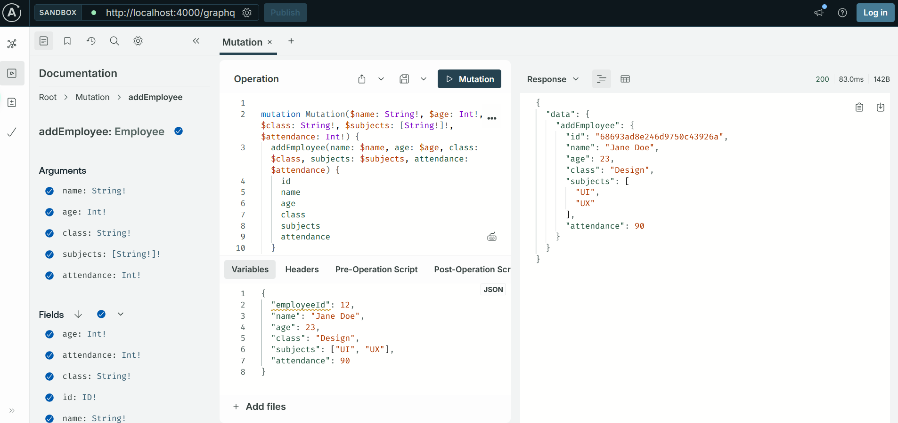
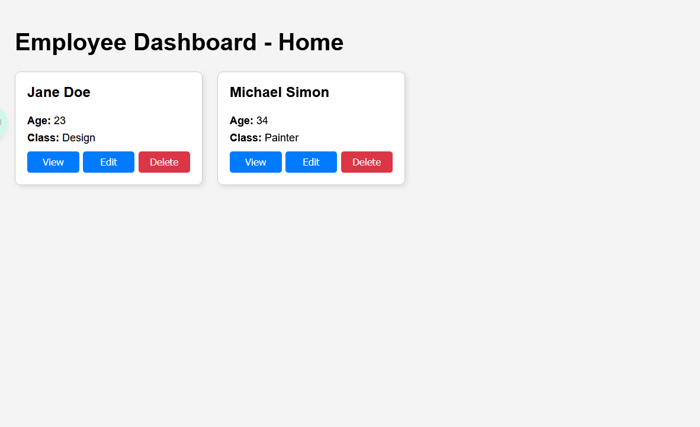

# 📋 Employee Dashboard – Full Stack GraphQL App

This is a full-stack application built with:

* 🖥️ **Frontend**: React + Apollo Client
* 🔧 **Backend**: Node.js, Express, Apollo Server (GraphQL)
* 🗃️ **Database**: MongoDB Atlas

---

## 🚀 Features

* Grid/Tile view to display employee data
* Detail view for each employee
* Edit and Delete employee records
* GraphQL API with JWT-based role authorization (`ADMIN` role)
* React routing and reusable components

---

## 📁 Project Structure

```
employee-dashboard/
├── backend/        → Node.js + GraphQL server
├── frontend/       → React client
├── package.json    → Root script to run both
```
---

## ⚙️ Setup Instructions

### 1. Clone the repository

```bash
git clone https://github.com/yashrsb/employee-dashboard
cd employee-dashboard
```

### 2. Add Environment Variables

Create a `.env` file in `backend/`:

```
MONGO_URI=mongo_connection_string_with_database_name
JWT_SECRET=random_secret_key
```

> ✅ MongoDB should include a database called `employee` with a `User` collection.

---

### 3. Install Dependencies

```bash
npm install
cd backend && npm install
cd ../frontend && npm install
```

---

### 4. Run Frontend & Backend Together

From the root `employee-dashboard/` directory:

```bash
npm run dev
```

* Frontend: [http://localhost:3000](http://localhost:3000)
* Backend GraphQL Playground: [http://localhost:4000/graphql](http://localhost:4000/graphql)

---

## 🔎 Example Queries

### Fetch all employees:

```graphql
query {
  employees {
    id
    name
    age
    class
  }
}
```

### Add employee:

```graphql
mutation {
  addEmployee(
    name: "Jane Doe"
    age: 30
    class: "Design"
    subjects: ["UI", "UX"]
    attendance: 90
  ) {
    id
  }
}
```

---

## ✅ ScreenShots


